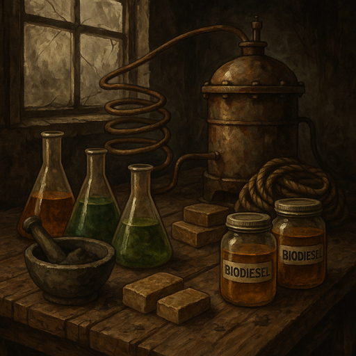
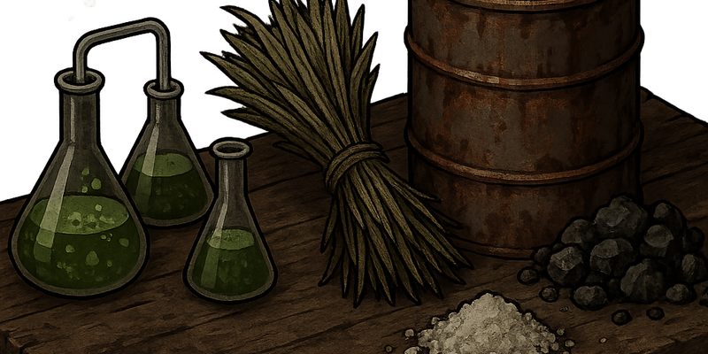
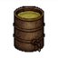
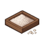

<!--
  ________________________________________________________________________
 / Copyright (c) 2026 Phobos A. D'thorga                                \
 |                                                                        |
 |           /\_/\                                                         |
 |         =/ o o \=    Phobos' PZ Modding                                |
 |          (  V  )     All rights reserved.                              |
 |     /\  / \   / \                                                      |
 |    /  \/   '-'   \   This source code is part of the Phobos            |
 |   /  /  \  ^  /\  \  mod suite for Project Zomboid (Build 42).         |
 |  (__/    \_/ \/  \__)                                                  |
 |     |   | |  | |     Unauthorised copying, modification, or            |
 |     |___|_|  |_|     distribution of this file is prohibited.          |
 |                                                                        |
 \________________________________________________________________________/
-->

  

# PhobosChemistryPathways

**Version:** 1.5.0 | **Requires:** Project Zomboid Build 42.14.0+ | PhobosLib 1.18.1+ | [Zombie Virus Vaccine](https://steamcommunity.com/sharedfiles/filedetails/?id=3615135168)

> **Players:** Subscribe on [Steam Workshop](https://steamcommunity.com/sharedfiles/filedetails/?id=3668197831) for easy installation. This GitHub repo is for source code, documentation, and development.
>
> **Modders & Developers:** Bug reports, feature requests, and contributions are welcome via [GitHub Issues](https://github.com/phobos-dthorga/mod-pz-chemistry-pathways/issues).

A complete industrial chemistry and biomass processing suite for Project Zomboid Build 42, adding realistic crafting pathways for blackpowder, biodiesel, soap, bone char, salt extraction, agriculture, recycling, botanical hemp processing, horticulture, and advanced laboratory processes.

> **Part of the Phobos' Industrial Pathways mod series.** Internal mod ID remains `PhobosChemistryPathways` for backward compatibility.

**Dependencies:** [PhobosLib](https://github.com/phobos-dthorga/mod-pz-phobos-lib) ([Workshop](https://steamcommunity.com/sharedfiles/filedetails/?id=3668598865)) | [Zombie Virus Vaccine](https://steamcommunity.com/sharedfiles/filedetails/?id=3615135168)

This project is open-source, but the Steam Workshop upload is the official distribution channel. The goal of this repository is to allow collaboration, compatibility extensions, and dependency usage while preserving authorship identity.

  

## Features

### Applied Chemistry Skill System
Custom `AppliedChemistry` perk under the Crafting parent with a steeper XP curve (75-9000). Two occupations (Chemist and Pharmacist) and two traits (Chemistry Enthusiast and Chemical Aversion) provide starting skill bonuses. Five skill book volumes cover levels 1-10, distributed in loot from common (Vol 1-2) to very rare (Vol 5). Six category recipe books (Field, Kitchen, Lab, Industrial, Horticulture, plus Complete Chemistry Compendium) unlock pathway-specific recipes. All 301 recipes award Applied Chemistry XP with 7 tiers of skill requirements.

###  Blackpowder Pathway
Seven-step chain from raw charcoal to gunpowder: crush, purify (water or alkaline wash), prepare compost, extract battery acid, extract sulphur, synthesize potassium nitrate, and mix blackpowder.

###  Biodiesel Pathway
Five-step chain from raw crops to refined fuel. Extract oil from 6 crop types (soybeans, sunflower, corn, flax, hemp, peanuts) using 3 equipment tiers (mortar and pestle, chemistry set, metal drum). Transesterify with methanol and KOH or NaOH catalyst, water-wash, and refine into usable vehicle fuel.

### Fat Rendering and Oil Conversion
Render lard, butter, or margarine into biodiesel feedstock. Or slow-cook any butchered meat cut (6 pieces → 2 jars of rendered fat + bone scraps) in a cooking pot — a renewable source of fat from animal husbandry. Convert bottled vegetable or olive oil directly.

### Soap-Making
Two soap pathways: glycerol-based crude soap from biodiesel by-products, and traditional fat-based soap from rendered animal fats. Both support KOH and NaOH catalysts.

### Bone Char Production
Pyrolyse animal bones and skulls in metal drums to produce bone char, an alternative to purified charcoal in filtration and reagent recipes.

###  Salt Extraction Pathway
Collect brine from water wells via right-click context menu, concentrate through evaporation, crystallize into rock salt, and purify into table salt. Six-recipe chain using condition-based purity tracking. Uses PhobosLib_WorldAction for well interaction.

###  Botanical Pathway
Thirty-one recipes for hemp processing: chemical retting with KOH or NaOH, fiber/hurd splitting, then branching into textiles (twine, rope, tarred rope, cloth, canvas), papermaking (pulp, chemical pulping, paper sheets), medicinals (poultice, tincture), and hurd processing (charcoal, hempcrete blocks, compost, fire bundles). Reinforced hempcrete (H14b) embeds tarred rope for higher yield (3 blocks vs 2). HempRope and TarredHempRope are tagged `base:rope` for vanilla recipe substitution; TarredHempRope is also usable as campfire fuel. Cross-links to blackpowder (charcoal from hurds), biodiesel (wood tar for tarring), and construction (hempcrete via concrete mixer). Vanilla station integration (Scutching Board, Looms, Hand Press) for fiber extraction, weaving, and oil pressing. Gated by `EnableBotanicalPathway` sandbox option.

### Horticulture Items
45 items providing full parity with the [B42] Horticulture mod: tobacco (wet leaves with air-dry mechanic, dual-path chewing tobacco via fire-cure or 14-day jar fermentation), hemp buds (fresh, cured, decarboxylated, canned variants, ground loose pouch), papermaking tools (mould and deckle, rolling papers), smoking products (glass pipe, loaded pipes, cigars, cigarettes, packs), edibles (hemp butter, hemp-infused oil), and cooking (sugar syrup). Dual-trigger migration system converts existing Horticulture mod items to PCP equivalents. Canned hemp buds show fermentation progress (%) and remaining days via dynamic tooltip; canning date stamped on creation. Medicinal items (poultice, tincture) trigger timed actions with visual/audio feedback and a Medicated custom moodle (requires Moodle Framework). Hemp product effects are fully configurable via 33 sandbox options on the PCP_HempEffects settings page.

### Advanced Lab Equipment
Centrifuge, chromatograph, microscope, and spectrometer recipes for enhanced processing. Microscope and spectrometer are gated by the EnableAdvancedLabRecipes sandbox option.

### Impurity/Purity System
Optional condition-based purity tracking (0-100%, normalised via item condition) through recipe chains. Equipment quality factors, severity scaling, yield penalties, and player feedback via speech bubbles and custom tooltips. Purity tooltip hidden at full condition to avoid false labels on unstamped or looted items.

### Recycling Pathway
Nine-step recycling chain (R1-R9): wood tar to wood glue and tar-pitch torches, calcite to quicklime and fertilizer (with sulphur-enhanced and potash variants), crude soap to usable bars and sterilized bandages, lead scrap to fishing tackle, plastic scrap to glue (with hazard variants), and acid-washed electronics to precision components.

### Agriculture & Downstream Applications
Six pathways connecting PCP intermediates to vanilla gameplay systems: garden pest sprays (sulphur fungicide, insecticidal soap, potash foliar — functional B42 crop cures), mineral feed supplements, water purification and gas mask filter recharging, epoxy resin synthesis, fire-starting materials (lighter fluid, matchboxes), and chemical leather tanning and plaster powder.

###  Concrete Mixer Workstation
Powered CraftBench entity for industrial-scale material processing. Build a concrete mixer from a metal drum, salvaged motor, scrap metal, and welding equipment (Metalworking 4). Requires electricity (grid, generator, or custom power source). 13 recipes: concrete, clay cement, mortar, stucco, reinforced concrete, fireclay, bulk blackpowder, bulk biodiesel, bulk soap, bulk compost, plaster, and wood vinegar. Generator fuel drain during crafting.

### In-Game Guide & Changelog
Welcome guide popup on first install explaining chemistry pathways, sandbox options, and getting started. "Don't show again" checkbox per character. Version-based "What's New" changelog popup on major/minor version bumps showing relevant changes since last played version.

### Empty Vessel Replacement
Empty PCP FluidContainers automatically revert to their vanilla vessel equivalents (mason jar + lid, bottle, bucket, gas can) when the player opens a container. Gated by `EnableVesselReplacement` sandbox option. MP-synced.

### Health Hazard System
Optional hazard system for 11 dangerous chemistry recipes. Each splits into Protected (mask + goggles required, filter degrades) and Unprotected (risk of disease or stat penalties) variants. Integrates with EHR (Extensive Health Rework) when available, with vanilla stat fallback. Mechanical hazard system (smoke inhalation and mineral dust) uses a light PPE tier where a dust mask is sufficient.

### Tiered Reset/Cleanup System
Five one-shot sandbox options on a dedicated "PCP - Maintenance / Reset" settings page for version upgrades and mod removal. Strip purity data, forget recipes, reset skill XP, remove all PCP items, or execute all four as a nuclear reset. Each option executes once on game load, then auto-resets to OFF with persistent notifications. Reset flags persist across game restarts via world modData.

### Cross-Mod Integration
- **ZScienceSkill** ("Science, Bitch!"): When active, Applied Chemistry XP mirrors to Science at 50% rate, and 83 items + 8 fluids are registered as researchable microscope specimens.
- **EHR** (Extensive Health Rework): When active, health hazard recipes dispatch EHR diseases instead of vanilla stat penalties.
- **Dynamic Trading** (DynamicTradingCommon): When active, 76 PCP items are registered for NPC trading with a custom "Chemical" tag and "Chemist" trader archetype (with chemistry-themed dialogue) via PhobosLib_Trading. Chemical allocations injected into 8 existing DT archetypes.
- **Neat Crafting**: When active, recipe visibility filters are applied through `NC_FilterBar:shouldIncludeRecipe()` in addition to vanilla UI hooks. Runtime-detected, no hard dependency.
- **Moodle Framework**: When active, medicinal hemp items (poultice, tincture) trigger a "Medicated" custom moodle with configurable duration. Graceful no-op when not installed.

## Requirements

| Dependency | Purpose |
|------------|---------|
| **PhobosLib 1.18.1+** | Shared utility library (sandbox access, fluid helpers, quality tracking, hazard dispatch, skill XP mirroring, reset utilities, startup validation, recipe visibility filters, item tooltip customisation, lazy container stamping, empty vessel replacement, farming spray registration, versioned migration framework, Dynamic Trading wrapper, powered workstation support, in-game popup system, world object context menus, entity rebinding, skill bonus helpers, notice popups, debug logging, fermentation registry, Moodle Framework wrapper) |
| **Zombie Virus Vaccine** (ZVirusVaccine42BETA) | Lab equipment entities (chemistry set, centrifuge, chromatograph, microscope, spectrometer) |
| **EHR** (optional) | Disease system for health hazard integration; vanilla stat penalties used as fallback |
| **ZScienceSkill** (optional) | Science skill XP mirroring and microscope specimen registration |
| **Dynamic Trading** (optional) | NPC trader item registration with custom tag and archetype |
| **Neat Crafting** (optional) | Recipe visibility filter compatibility via NC_FilterBar hook |
| **Moodle Framework** (optional) | Custom Medicated moodle for medicinal hemp items |

## Sandbox Options

| Option | Type | Default | Description |
|--------|------|---------|-------------|
| YieldMultiplier | 0.25 - 4.0 | 1.0 | Scales recipe output quantities |
| EnableAdvancedLabRecipes | boolean | false | Gates microscope and spectrometer recipes |
| RequireHeatSources | boolean | true | Gates fuel requirements on heated recipes |
| EnableImpuritySystem | boolean | true | Enables purity tracking through recipe chains |
| ImpuritySeverity | 1-3 | 2 | Controls purity degradation intensity (Mild/Standard/Harsh) |
| SkillPurityInfluence | 1-4 | 3 | Skill effect on purity (None/Low/Standard/High) |
| ShowPurityOnCraft | boolean | true | Shows purity speech bubble after crafting |
| EnableHealthHazards | boolean | false | Enables Protected/Unprotected recipe variants for hazardous chemistry |
| EnableBotanicalPathway | boolean | true | Enables botanical hemp processing recipes and horticulture items |
| ResetStripPurity | boolean | false | One-shot: strip purity modData from all items |
| ResetForgetRecipes | boolean | false | One-shot: forget all learned PCP recipes |
| ResetSkillXP | boolean | false | One-shot: reset Applied Chemistry to level 0 |
| ResetNuclearRemove | boolean | false | One-shot: remove all PCP items from inventory |
| EnableVesselReplacement | boolean | true | Replaces empty PCP FluidContainers with vanilla vessels on container open |
| EnableConcreteMixer | boolean | true | Enables concrete mixer workstation and recipes |
| ConcreteMixerYieldBonus | 0.25 - 4.0 | 1.0 | Output yield multiplier for mixer recipes |
| MixerFuelDrainRate | 0.0 - 5.0 | 0.5 | Generator fuel drain rate (%/min) during mixer crafting |
| ResetNuclearAll | boolean | false | One-shot: execute all four reset operations |
| MigrateHorticultureItems | boolean | false | One-shot: convert [B42] Horticulture items to PCP equivalents |
| EnableHempEffects | boolean | true | Enables medicinal and recreational effects on hemp/tobacco items |
| EnableDebugLogging | boolean | false | Enables debug logging to console.txt via PhobosLib_Debug |

The **PCP_HempEffects** settings page provides 33 additional per-product stat knobs (pipes, cigars, cigarettes, decarbed buds, poultice, tincture, sugar syrup) and 2 moodle duration controls. These options are only visible when EnableHempEffects is ON.

## Content Summary

- **301 recipes** across blackpowder, biodiesel, soap, bone char, salt extraction, recycling, agriculture, concrete mixer, botanical, horticulture, utility, and advanced lab pathways
- **121 items** including chemical reagents, intermediates, container variants, gardening sprays, construction materials, salt products, botanical textiles, horticulture products, and smoking items
- **76 tradeable items** registered with Dynamic Trading across 9 vendor archetypes
- **6 recipe books** (1 master compendium + 5 category-specific) teaching pathway-specific recipes
- **5 skill books** covering Applied Chemistry levels 1-10
- **2 occupations** (Chemist, Pharmacist) and **2 traits** (Chemistry Enthusiast, Chemical Aversion)
- **10 fluids** with Build 42 FluidContainer integration and poison profiles
- **66 sandbox options** for gameplay customization, vessel replacement, concrete mixer, botanical pathway, hemp effects tuning, and maintenance
- **216 OnCreate callbacks** for purity tracking and propane partial consumption

## License

This project uses dual licensing:
- **Code** (Lua scripts, recipe definitions, item definitions): [MIT License](LICENSE)
- **Assets** (textures, icons, images): [CC BY-NC-SA 4.0](LICENSE-CC-BY-NC-SA.txt)

Forks and addons are encouraged. Code is permissively licensed for integration. Assets are protected from unauthorized redistribution.

## Documentation

Visual guides for understanding recipe chains, sandbox settings, and mod architecture:

- [Recipe Pathways](docs/diagrams/recipe-pathways.md) — Complete crafting chain flowcharts for all chemistry pathways
- [Botanical & Horticulture Pathways](docs/diagrams/botanical-pathways.md) — Hemp processing, textiles, paper, medicinals, and horticulture items
- [Recipe Variants](docs/diagrams/recipe-variants.md) — Why PCP recipes have multiple versions, naming conventions, and troubleshooting
- [Sandbox Settings Guide](docs/diagrams/sandbox-gating.md) — How 66 sandbox options control recipe visibility, behavior, hemp effects, and maintenance
- [Skill Progression](docs/diagrams/skill-progression.md) — Applied Chemistry skill tiers, XP curve, occupations, and traits
- [Architecture & Dependencies](docs/diagrams/architecture.md) — Dependency graph, PhobosLib modules, and cross-mod integration

See [docs/README.md](docs/README.md) for the full index. See `docs/art-style-guidelines.md` for icon contribution guidelines.

## Verification Checklist

After each intermediate or major version bump, verify:

- [ ] No `FluidCategory` enum errors in `console.txt` (all PCP fluids use valid B42 categories)
- [ ] No `CharacterTrait.*null` errors — all 3 traits + 2 professions load (check character creation screen)
- [ ] No `item not found` errors for recipe outputs (grep `console.txt` for `PCP`)
- [ ] `registries.lua` registers all traits/professions (no "removing script due to load error" for PCP entries)
- [ ] `[PhobosLib:Validate]` shows no MISSING entries for PCP dependencies
- [ ] Custom `AppliedChemistry` perk appears in skills panel
- [ ] At least one recipe per pathway is craftable (smoke test)

## Further Reading
- [PROJECT_IDENTITY.md](PROJECT_IDENTITY.md) — Authorship and fork policy
- [MODDING_PERMISSION.md](MODDING_PERMISSION.md) — What you can and cannot do with this mod
- [CONTRIBUTING.md](CONTRIBUTING.md) — How to contribute
- [CHANGELOG.md](CHANGELOG.md) — Release history
- [VERSIONING.md](VERSIONING.md) — Versioning policy
