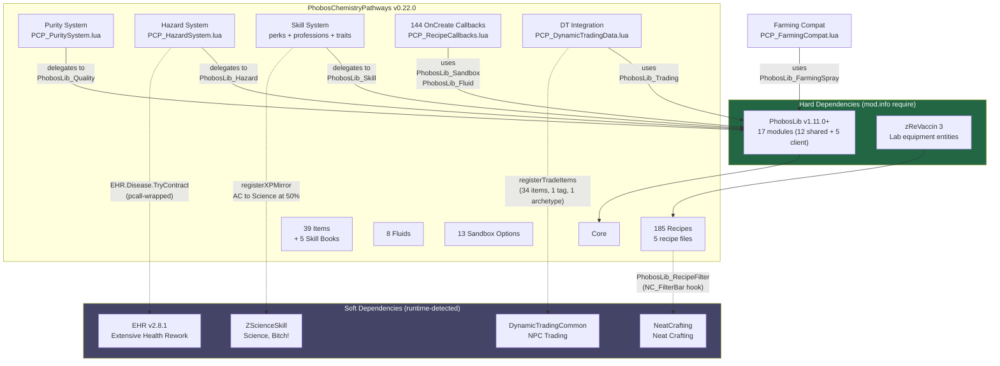
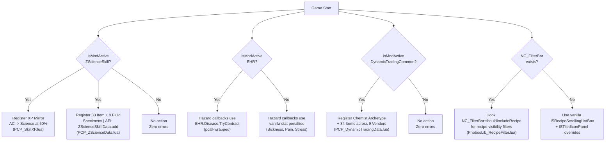

<!--
  ________________________________________________________________________
 / Copyright (c) 2026 Phobos A. D'thorga                                \
 |                                                                        |
 |           /\_/\                                                         |
 |         =/ o o \=    Phobos' PZ Modding                                |
 |          (  V  )     All rights reserved.                              |
 |     /\  / \   / \                                                      |
 |    /  \/   '-'   \   This source code is part of the Phobos            |
 |   /  /  \  ^  /\  \  mod suite for Project Zomboid (Build 42).         |
 |  (__/    \_/ \/  \__)                                                  |
 |     |   | |  | |     Unauthorised copying, modification, or            |
 |     |___|_|  |_|     distribution of this file is prohibited.          |
 |                                                                        |
 \________________________________________________________________________/
-->

# Architecture & Dependencies

PhobosChemistryPathways (PCP) has two hard dependencies (PhobosLib and zReVaccin 3) and four optional soft dependencies that are detected at runtime. All cross-mod integrations are guarded by `getActivatedMods():contains()` checks, so players who install only PCP and its required dependencies will never encounter errors from missing optional mods.

## Mod Architecture

The diagram below shows PCP's internal module structure, its hard dependencies, and how each subsystem delegates to PhobosLib.

## Cross-Mod Integration

Each soft dependency is detected at game start. When present, PCP registers its data with the external mod's API. When absent, the integration code is silently skipped with zero errors.

## File Locations

| Directory | Contents |
|-----------|----------|
| `42/media/scripts/` | Item definitions, recipe definitions, fluid definitions, sandbox options, perks, professions, traits |
| `42/media/lua/client/` | Tooltip providers, recipe filters, vessel replacement, lazy stamping, farming compat, Dynamic Trading stamp |
| `42/media/lua/server/` | Skill book registration, recipe callbacks, purity system, hazard system |
| `42/media/lua/shared/` | Skill XP mirroring, ZScience data registration, Dynamic Trading data, registries |
| `42/media/lua/shared/Translate/EN/` | English translation strings for items, recipes, sandbox options, tooltips |
