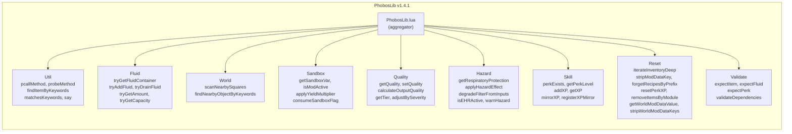

# Architecture & Dependencies

How PCP connects to its dependencies and optional cross-mod integrations.

## Dependency Hierarchy

---

## PhobosLib Module Breakdown

> **Usage**: `require "PhobosLib"` loads all modules into the global `PhobosLib` table. Individual modules cannot be loaded independently.

---

## Cross-Mod Integration

### Detection Pattern

All soft dependencies use the same pattern:
1. Check at game startup via `PhobosLib.isModActive("ModID")`
2. If active, register hooks/data
3. All calls wrapped in `pcall` for safety if the mod is uninstalled mid-save

### Soft Dependency Behavior

| Dependency | Mod ID | Detection | When Active | When Inactive |
|-----------|--------|-----------|-------------|---------------|
| **ZScienceSkill** | `ZScienceSkill` | `isModActive` + `pcall` API check | Applied Chemistry XP mirrors to Science at 50% rate. 33 item specimens + 8 fluid specimens registered via `ZScienceSkill.Data.add()` with dual Science+AppliedChemistry XP. | No XP mirroring. No specimen registration. Zero errors. |
| **EHR** | `EHR` | `isModActive` + `pcall(EHR.Disease.IsEnabled)` | Unsafe hazard recipes trigger EHR diseases with protection scaling (corpse_sickness, pneumonia, wound_infection). | Unsafe recipes fall back to vanilla stat penalties (CharacterStat.SICKNESS/PAIN/STRESS). |

### ZScienceSkill XP Mirroring

> **Note**: ZScienceSkill is currently removed from the Steam Workshop. The integration remains functional for players who have it installed locally.

### EHR Disease Dispatch

When EnableHealthHazards is ON and EHR is active, unsafe recipe callbacks call `EHR.Disease.TryContract(player, diseaseId, chance)` with protection scaling:

| Protection Level | Effect Multiplier |
|-----------------|-------------------|
| NBC Mask (no filter) | 15% of full effect |
| Gas Mask (no filter) | 40% of full effect |
| No mask | 100% of full effect |

All EHR calls are wrapped in `pcall`. If the call fails (mod uninstalled), the vanilla stat fallback triggers automatically.

---

## Entity Workstation System

PCP uses the Build 42 entity system for Metal Drum proximity detection:

> **No NearItem property**: Build 42 `craftRecipe` does not have NearItem. Proximity is handled entirely through the Tags + CraftBench entity binding system.

### Additional Workstation Tags (v0.11.0)

PCP also uses vanilla workstation tags for recipes that don't need the custom MetalDrum entity:

| Tag | Workstations | Used By |
|-----|-------------|---------|
| `WoodCharcoal` | Charcoal Pit, Charcoal Burner, Dome Kiln | Bone char pyrolysis (B1) |
| `DomeKiln` | Dome Kiln only | Calcite calcination (R2) |
| `PrimitiveFurnace` | Primitive, Smelting, Blast Furnace | Lead casting (R6) |

> **Bone char migration**: In v0.11.0, bone char recipes moved from the custom `PCP:MetalDrumStation` tag to the vanilla `WoodCharcoal` tag. This allows players to use any charcoal-producing kiln, not just the metal drum.

---

## Multiplayer & NPC Safety

PhobosChemistryPathways and PhobosLib are designed to be safe in multiplayer
and NPC-mod environments (e.g. Knox Event Expanded).

### Architecture Decisions

| Decision | Rationale |
|----------|-----------|
| No `getPlayer()` calls | All functions receive `player` as a parameter from the engine |
| All methods on `IsoGameCharacter` | `getInventory()`, `getWornItems()`, `getStats()`, `Say()` exist on the base class shared by IsoPlayer and IsoNpcPlayer |
| Item modData for state | Purity values stored in item modData, which auto-syncs between server and clients |
| SandboxVars via wrapper | `PhobosLib.getSandboxVar()` reads server-authoritative values |
| pcall on all cross-mod calls | EHR, ZScienceSkill API calls wrapped for safety if mod is removed mid-save |
| `isClient()` guards on init | OnGameStart hooks skip client-side to avoid redundant registration |
| Client code in `client/` only; sandbox gating in `shared/` | Tooltip rendering is the only client-only code; OnTest callbacks (`PCP_SandboxIntegration.lua`) are in `shared/` for client+server access; remaining gameplay logic is in `server/` |

### For Server Administrators

- All sandbox options are **server-authoritative** — clients cannot cheat them
- Purity metadata travels with items via modData (no custom networking)
- Startup logs include `[server]` or `[local]` context tags for debugging
- ZScienceSkill and EHR integrations are runtime-detected and pcall-wrapped — safe to add or remove mid-save

### For NPC Mod Authors

PhobosLib utility functions accept any `IsoGameCharacter` (not just `IsoPlayer`):
- `PhobosLib.say(character, msg)` — speech bubble, works for NPCs
- `PhobosLib.getRespiratoryProtection(character)` — scans worn items, works for NPCs
- `PhobosLib.addXP(character, perk, amount)` — pcall-wrapped, fails silently if NPC cannot gain XP

Recipe OnCreate callbacks receive the crafting character as `player`. If future NPC mods
allow NPCs to craft, PCP callbacks will work correctly since all called methods exist on
`IsoGameCharacter`.
