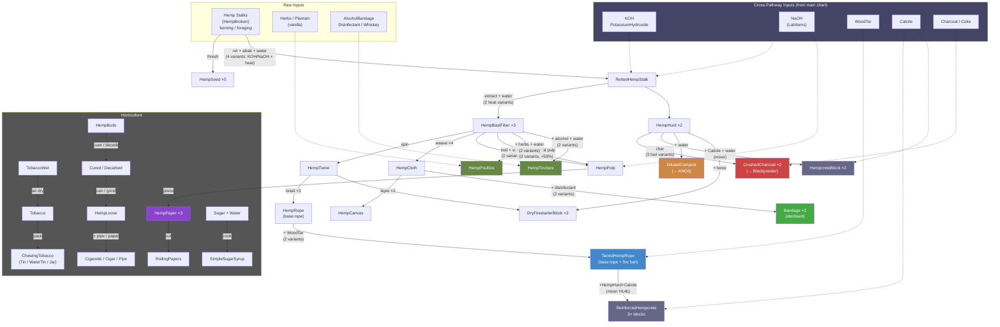

<!--
  ________________________________________________________________________
 / Copyright (c) 2026 Phobos A. D'thorga                                \
 |                                                                        |
 |           /\_/\                                                         |
 |         =/ o o \=    Phobos' PZ Modding                                |
 |          (  V  )     All rights reserved.                              |
 |     /\  / \   / \                                                      |
 |    /  \/   '-'   \   This source code is part of the Phobos            |
 |   /  /  \  ^  /\  \  mod suite for Project Zomboid (Build 42).         |
 |  (__/    \_/ \/  \__)                                                  |
 |     |   | |  | |     Unauthorised copying, modification, or            |
 |     |___|_|  |_|     distribution of this file is prohibited.          |
 |                                                                        |
 \________________________________________________________________________/
-->

# Botanical & Horticulture Pathways

PhobosChemistryPathways adds a botanical hemp processing pathway with 31 recipes across 4 crafting tiers (Field, Kitchen, Lab, Mixer), plus 31 horticulture items for tobacco, hemp buds, papermaking tools, smoking, and cooking. Hemp stalks from vanilla farming or foraging feed the entire chain, with cross-pathway links to the main chemistry chart via KOH/NaOH (retting), wood tar (tarring), calcite (hempcrete), and charcoal (hurd processing).

This is a companion diagram to the [main recipe overview](recipe-pathways.md), kept separate for readability.

## Botanical Pathway Flowchart

## Legend

- **Red** -- Cross-pathway output: CrushedCharcoal (feeds back into blackpowder pathway)
- **Orange** -- Cross-pathway output: DilutedCompost (feeds back into KNO3 synthesis)
- **Blue** -- Textile output: TarredHempRope (waterproofed with wood tar from biodiesel by-products; tagged `base:rope` + fire fuel; feeds into reinforced hempcrete)
- **Green** -- Medical output: Sterilised bandages (from hemp cloth + disinfectant)
- **Purple** -- Paper output: HempPaper (for papermaking and rolling papers)
- **Dark green** -- Medicinal outputs: HempPoultice and HempTincture
- **Steel blue** -- Construction output: HempcreteBlock (hemp hurds + calcite, mixer recipe)
- **Dark blue** -- Cross-pathway inputs from the main chemistry chart (KOH, NaOH, WoodTar, Calcite)
- **Dotted lines** -- Cross-pathway links

## Botanical Recipe Breakdown (31 recipes)

### Retting & Fiber Extraction (7 recipes)
- **PCPThreshHempSeeds** -- Thresh hemp stalks for seeds (Field)
- **PCPRetHemp / PCPRetHempSimple** -- Chemical retting with KOH (Kitchen, 2 heat variants)
- **PCPRetHempNaOH / PCPRetHempNaOHSimple** -- Chemical retting with NaOH (Lab, 2 heat variants)
- **PCPExtractBastFiber / PCPExtractBastFiberSimple** -- Scutching: split retted stalks into bast fiber + hurds (Kitchen, 2 heat variants)

### Textile Processing (5 recipes)
- **PCPSpinHempTwine** -- Spin bast fiber into twine (Field)
- **PCPBraidHempRope** -- Braid twine into rope (Field)
- **PCPWeaveHempCloth** -- Weave bast fiber into cloth (Kitchen)
- **PCPMakeHempCanvas** -- Layer cloth into canvas (Kitchen)
- **PCPTarHempRope / PCPTarHempRopeSimple** -- Tar rope with wood tar (Kitchen, 2 heat variants)

### Papermaking (5 recipes)
- **PCPBoilHempPulp / PCPBoilHempPulpSimple** -- Boil bast fiber into pulp (Kitchen, 2 heat variants)
- **PCPChemicalPulping / PCPChemicalPulpingSimple** -- NaOH chemical pulping for higher yield (Lab, 2 heat variants)
- **PCPPressHempPaper** -- Press pulp into paper sheets (Lab)

### Medicinal (4 recipes)
- **PCPPrepareHempPoultice / PCPPrepareHempPoulticeSimple** -- Herb-infused poultice (Kitchen, 2 heat variants)
- **PCPPrepareHempTincture / PCPPrepareHempTinctureSimple** -- Alcohol-extracted tincture (Lab, 2 heat variants)

### Hurd Processing (5 recipes)
- **PCPCharHempHurds** -- Char hurds with charcoal fuel (Field)
- **PCPCharHempHurdsCoke** -- Char hurds with coke fuel (Field)
- **PCPCharHempHurdsSimple** -- Char hurds without fuel (Field, simplified)
- **PCPCompostHempHurds** -- Compost hurds into diluted compost (Field)
- **PCPMakeHempFireBundle** -- Bundle hurds + twine into firestarters (Field)

### Cross-Pathway Integrations (4 recipes)
- **PCPSterilizeHempBandage / PCPSterilizeHempBandageSimple** -- Sterilise hemp cloth into bandages (Kitchen, 2 heat variants)
- **PCPMixHempcrete** -- Mix hurds + calcite in concrete mixer (Industrial)
- **PCPMixReinforcedHempcrete** (H14b) -- TarredHempRope + HempHurd + Calcite + Water in concrete mixer, yields 3x HempcreteBlock (Industrial)

### Crafting Tier Summary

| Tier | Category | Recipes |
|------|----------|---------|
| Field | Phobos Field Chem | 8 |
| Kitchen | Phobos Kitchen Chem | 14 |
| Lab | Phobos Lab Chem | 7 |
| Industrial | Phobos Industrial Chem (Mixer) | 2 |
| **Total** | | **31** |

## Horticulture Items

31 horticulture items with full item scripts, translations, and tooltips:

- **Tobacco** (4 items) -- TobaccoWet (air-dries naturally), ChewingTobacco in 3 container types (Tin, WaterTin, Jar)
- **Hemp Buds** (9 items) -- Fresh, Cured, and Decarboxylated buds; canned variants (sealed and open); ground HempLoose
- **Papermaking** (5 items) -- PaperPulpPot (2 pot types), MouldAndDeckle, MouldAndDecklePaperSheet, RollingPapers
- **Smoking** (10 items) -- Glass pipe, loaded pipes (wood/glass/can), hemp cigars, hemp cigarettes, cigarette packs, rolled tobacco cigars and cigarettes
- **Cooking** (3 items) -- SaucepanSyrup (2 pot types), SimpleSugarSyrup

These items support a [B42] Horticulture mod migration system (see [Sandbox Settings Guide](sandbox-gating.md) for the MigrateHorticultureItems option).
