<!--
  ________________________________________________________________________
 / Copyright (c) 2026 Phobos A. D'thorga                                \
 |                                                                        |
 |           /\_/\                                                         |
 |         =/ o o \=    Phobos' PZ Modding                                |
 |          (  V  )     All rights reserved.                              |
 |     /\  / \   / \                                                      |
 |    /  \/   '-'   \   This source code is part of the Phobos            |
 |   /  /  \  ^  /\  \  mod suite for Project Zomboid (Build 42).         |
 |  (__/    \_/ \/  \__)                                                  |
 |     |   | |  | |     Unauthorised copying, modification, or            |
 |     |___|_|  |_|     distribution of this file is prohibited.          |
 |                                                                        |
 \________________________________________________________________________/
-->

# Botanical & Horticulture Pathways

PhobosChemistryPathways adds a botanical hemp processing pathway across 4 crafting tiers (Field, Kitchen, Lab, Mixer) plus vanilla station integration (Scutching Board, Looms, Hand Press), along with 31 horticulture items for tobacco, hemp buds, papermaking tools, smoking, and cooking. Hemp stalks from vanilla farming or foraging feed the entire chain, with cross-pathway links to the main chemistry chart via KOH/NaOH (retting), wood tar (tarring), calcite (hempcrete), and charcoal (hurd processing). The hemp expansion adds 6 new items (Seed Press Cake, Hemp Sack, Oakum, Hemp Fishing Net, Hemp Sheet Rope, Hemp Snare) and end-product branches for fishing, trapping, and construction.

This is a companion diagram to the [main recipe overview](recipe-pathways.md), kept separate for readability.

## Botanical Pathway Flowchart

```mermaid
graph TB
    %% ═══ RAW INPUTS ═══
    subgraph IN["Raw Inputs"]
        HEMP["Hemp Stalks<br/>(Broken Hemp)<br/>farming / foraging"]
        HEMPDRIED["Dried Hemp Bundle<br/>(vanilla)"]
        SEEDPASTE["Seed Paste<br/>(vanilla)"]
        HERBS["Herbs / Plantain<br/>(vanilla)"]
        ALCOHOL["Alcohol Bandage<br/>Disinfectant / Whiskey"]
    end

    subgraph XREF["Cross-Pathway Inputs (from main chart)"]
        KOH["Potassium Hydroxide<br/>(KOH)"]
        NAOH["Sodium Hydroxide<br/>(NaOH)"]
        WOODTAR["Wood Tar"]
        CALCITE["Calcite"]
        CHARCOAL["Charcoal / Coke"]
    end

    %% ═══ STAGE 1: RETTING & SPLITTING ═══
    HEMP -->|"thresh"| SEEDS["Hemp Seeds ×5"]
    HEMP -->|"ret + alkali + water<br/>(4 variants: KOH/NaOH × heat)"| RETTED["Retted Hemp Stalk"]
    KOH -.-> RETTED
    NAOH -.-> RETTED
    RETTED -->|"extract + water<br/>(2 heat variants)"| BAST["Hemp Bast Fiber ×3"]
    RETTED --> HURD["Hemp Hurd ×2"]

    %% ═══ SCUTCHING BOARD ROUTE ═══
    HEMPDRIED -->|"Scutch Fiber<br/>(Scutching Board)"| BAST
    HEMPDRIED -->|"Scutch Fiber<br/>(Scutching Board)"| HURD

    %% ═══ HAND PRESS ROUTE ═══
    SEEDPASTE -->|"Press Seed Oil<br/>(Hand Press)"| CRUDEOIL["Crude Vegetable Oil"]
    SEEDPASTE -->|"Press Seed Oil<br/>(Hand Press)"| PRESSCAKE["Seed Press Cake"]

    %% ═══ BAST FIBER CHAINS ═══
    %% Textile chain
    BAST -->|"spin"| TWINE["Hemp Twine"]
    TWINE -->|"braid ×3"| ROPE["Hemp Rope<br/>(rope equivalent)"]
    ROPE -->|"+ Wood Tar<br/>(2 variants)"| TARRED["Tarred Hemp Rope<br/>(rope + fire fuel)"]
    WOODTAR -.-> TARRED
    TARRED -->|"+ Hemp Hurd + Calcite<br/>(Concrete Mixer)"| REINFORCED["Reinforced Hempcrete<br/>3× blocks"]
    CALCITE -.-> REINFORCED

    BAST -->|"weave ×4"| CLOTH["Hemp Cloth"]
    BAST -->|"Weave Cloth<br/>(Loom)"| CLOTH
    BAST -->|"Weave Canvas<br/>(Loom)"| CANVAS["Hemp Canvas"]
    CLOTH -->|"layer ×2"| CANVAS
    CLOTH -->|"+ disinfectant<br/>(2 variants)"| BANDAGE["Bandage ×2<br/>(sterilised)"]

    %% End-product branches
    TWINE -->|"craft"| FISHNET["Hemp Fishing Net"]
    TWINE -->|"craft"| SNARE["Hemp Snare"]
    ROPE -->|"+ Hemp Cloth"| SHEETROPE["Hemp Sheet Rope"]
    CLOTH -.-> SHEETROPE
    CANVAS -->|"sew"| SACK["Hemp Sack"]
    BAST -->|"+ Wood Tar"| OAKUM["Oakum"]
    WOODTAR -.-> OAKUM

    %% Paper chain
    BAST -->|"boil + water<br/>(2 variants)"| PULP["Hemp Pulp"]
    BAST -->|"NaOH chemical pulp<br/>(2 variants, +50%)"| PULP
    NAOH -.-> PULP
    PULP -->|"press"| PAPER["Hemp Paper ×3"]

    %% Medicinal chain
    BAST -->|"+ herbs + water<br/>(2 variants)"| POULTICE["Hemp Poultice"]
    HERBS -.-> POULTICE
    BAST -->|"+ alcohol + water<br/>(2 variants)"| TINCTURE["Hemp Tincture"]
    ALCOHOL -.-> TINCTURE

    %% ═══ HURD CHAINS ═══
    HURD -->|"char<br/>(3 fuel variants)"| CHARCOAL_OUT["Crushed Charcoal ×2<br/>(→ Blackpowder)"]
    CHARCOAL -.-> CHARCOAL_OUT
    HURD -->|"+ Calcite + water<br/>(mixer)"| HEMPCRETE["Hempcrete Block ×2"]
    CALCITE -.-> HEMPCRETE
    HURD -->|"+ water"| COMPOST["Diluted Compost<br/>(→ KNO3)"]
    HURD -->|"+ twine"| FIRE["Dry Firestarter Block ×2"]
    TWINE --> FIRE

    %% ═══ SEED PRESS CAKE CHAINS ═══
    PRESSCAKE -->|"+ water"| COMPOST
    PRESSCAKE -->|"bag"| COMPOSTBAG["Compost Bag"]

    %% ═══ HORTICULTURE ═══
    subgraph HORT["Horticulture"]
        TOB_WET["Wet Tobacco"] -->|"air dry"| TOB_DRY["Tobacco"]
        TOB_DRY -->|"pack"| CHEW["Chewing Tobacco<br/>(Tin / Water Tin / Jar)"]
        BUDS["Hemp Buds"] -->|"cure / decarb"| BUDS_PROC["Cured / Decarbed"]
        BUDS_PROC -->|"can / grind"| LOOSE["Loose Hemp"]
        PAPER -->|"cut"| ROLLING["Rolling Papers"]
        LOOSE -->|"+ pipe / paper"| SMOKE["Cigarette / Cigar / Pipe"]
        SYRUP_IN["Sugar + Water"] -->|"cook"| SYRUP["Simple Sugar Syrup"]
    end

    %% ═══ STYLES ═══
    style CHARCOAL_OUT fill:#c44,color:#fff
    style COMPOST fill:#c84,color:#fff
    style HEMPCRETE fill:#668,color:#fff
    style BANDAGE fill:#4a4,color:#fff
    style TARRED fill:#48c,color:#fff
    style PAPER fill:#84c,color:#fff
    style POULTICE fill:#684,color:#fff
    style TINCTURE fill:#684,color:#fff
    style XREF fill:#446,color:#fff
    style REINFORCED fill:#668,color:#fff
    style FISHNET fill:#486,color:#fff
    style SNARE fill:#486,color:#fff
    style SHEETROPE fill:#48c,color:#fff
    style SACK fill:#486,color:#fff
    style OAKUM fill:#864,color:#fff
    style CRUDEOIL fill:#c84,color:#fff
    style PRESSCAKE fill:#c84,color:#fff
    style COMPOSTBAG fill:#c84,color:#fff
    style HORT fill:#555,color:#fff
```

## Legend

- **Red** -- Cross-pathway output: Crushed Charcoal (feeds back into blackpowder pathway)
- **Orange** -- Cross-pathway output: Diluted Compost (feeds back into KNO3 synthesis); also Crude Vegetable Oil, Seed Press Cake, and Compost Bag from Hand Press route
- **Blue** -- Textile output: Tarred Hemp Rope (waterproofed with wood tar; rope equivalent + fire fuel; feeds into Reinforced Hempcrete); also Hemp Sheet Rope
- **Green** -- Medical output: Sterilised bandages (from Hemp Cloth + disinfectant)
- **Purple** -- Paper output: Hemp Paper (for papermaking and Rolling Papers)
- **Dark green** -- Medicinal outputs: Hemp Poultice and Hemp Tincture
- **Steel blue** -- Construction output: Hempcrete Block (Hemp Hurd + Calcite, mixer recipe)
- **Teal** -- End-product outputs: Hemp Fishing Net, Hemp Snare, Hemp Sack (from textile branches)
- **Brown** -- Oakum (bast fiber + wood tar, used as waterproofing)
- **Dark blue** -- Cross-pathway inputs from the main chemistry chart (KOH, NaOH, Wood Tar, Calcite)
- **Dotted lines** -- Cross-pathway links

## Botanical Recipe Breakdown (37 recipes)

### Retting & Fiber Extraction (7 recipes)
- **PCPThreshHempSeeds** -- Thresh hemp stalks for seeds (Field)
- **PCPRetHemp / PCPRetHempSimple** -- Chemical retting with KOH (Kitchen, 2 heat variants)
- **PCPRetHempNaOH / PCPRetHempNaOHSimple** -- Chemical retting with NaOH (Lab, 2 heat variants)
- **PCPExtractBastFiber / PCPExtractBastFiberSimple** -- Scutching: split retted stalks into bast fiber + hurds (Kitchen, 2 heat variants)

### Textile Processing (5 recipes)
- **PCPSpinHempTwine** -- Spin bast fiber into twine (Field)
- **PCPBraidHempRope** -- Braid twine into rope (Field)
- **PCPWeaveHempCloth** -- Weave bast fiber into cloth (Kitchen)
- **PCPMakeHempCanvas** -- Layer cloth into canvas (Kitchen)
- **PCPTarHempRope / PCPTarHempRopeSimple** -- Tar rope with wood tar (Kitchen, 2 heat variants)

### Papermaking (5 recipes)
- **PCPBoilHempPulp / PCPBoilHempPulpSimple** -- Boil bast fiber into pulp (Kitchen, 2 heat variants)
- **PCPChemicalPulping / PCPChemicalPulpingSimple** -- NaOH chemical pulping for higher yield (Lab, 2 heat variants)
- **PCPPressHempPaper** -- Press pulp into paper sheets (Lab)

### Medicinal (4 recipes)
- **PCPPrepareHempPoultice / PCPPrepareHempPoulticeSimple** -- Herb-infused poultice (Kitchen, 2 heat variants)
- **PCPPrepareHempTincture / PCPPrepareHempTinctureSimple** -- Alcohol-extracted tincture (Lab, 2 heat variants)

### Hurd Processing (5 recipes)
- **PCPCharHempHurds** -- Char hurds with charcoal fuel (Field)
- **PCPCharHempHurdsCoke** -- Char hurds with coke fuel (Field)
- **PCPCharHempHurdsSimple** -- Char hurds without fuel (Field, simplified)
- **PCPCompostHempHurds** -- Compost hurds into diluted compost (Field)
- **PCPMakeHempFireBundle** -- Bundle hurds + twine into firestarters (Field)

### Cross-Pathway Integrations (4 recipes)
- **PCPSterilizeHempBandage / PCPSterilizeHempBandageSimple** -- Sterilise hemp cloth into bandages (Kitchen, 2 heat variants)
- **PCPMixHempcrete** -- Mix hurds + calcite in concrete mixer (Industrial)
- **PCPMixReinforcedHempcrete** (H14b) -- TarredHempRope + HempHurd + Calcite + Water in concrete mixer, yields 3x HempcreteBlock (Industrial)

### Hemp Expansion (6 recipes)
- **PCPPressOilHandPress** -- Press seed paste for crude vegetable oil on the Hand Press (Kitchen / Hand Press)
- **PCPMakeOakum** -- Tar bast fiber into oakum waterproofing (Kitchen / Loom)
- **PCPSewHempSack** -- Sew a carrying sack from hemp canvas and rope (Kitchen / Loom)
- **PCPKnotHempFishingNet** -- Knot a fishing net from hemp twine (Field)
- **PCPMakeHempSheetRope** -- Tie a sheet rope from hemp rope and cloth (Field)
- **PCPCraftHempSnare** -- Craft a snare trap from hemp twine and a stick (Field)

### Crafting Tier Summary

| Tier | Category | Recipes |
|------|----------|---------|
| Field | Phobos Field Chem | 11 |
| Kitchen | Phobos Kitchen Chem | 17 |
| Lab | Phobos Lab Chem | 7 |
| Industrial | Phobos Industrial Chem (Mixer) | 2 |
| **Total** | | **37** |

## Horticulture Items

31 horticulture items with full item scripts, translations, and tooltips:

- **Tobacco** (4 items) -- Wet Tobacco (air-dries naturally), Chewing Tobacco in 3 container types (Tin, Water Tin, Jar)
- **Hemp Buds** (9 items) -- Fresh, Cured, and Decarboxylated buds; canned variants (sealed and open); ground Loose Hemp
- **Papermaking** (5 items) -- Pot of Paper Pulp (2 pot types), Mould and Deckle, Mould and Deckle (Sheet), Rolling Papers
- **Smoking** (10 items) -- Glass Smoking Pipe, loaded pipes (wood/glass/can), Hemp Cigars, Hemp Cigarettes, cigarette packs, rolled tobacco cigars and cigarettes
- **Cooking** (3 items) -- Saucepan of Sugar Syrup (2 pot types), Simple Sugar Syrup

These items support a [B42] Horticulture mod migration system (see [Sandbox Settings Guide](sandbox-gating.md) for the MigrateHorticultureItems option).
