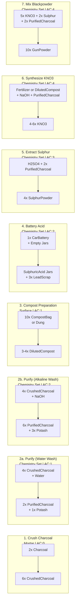
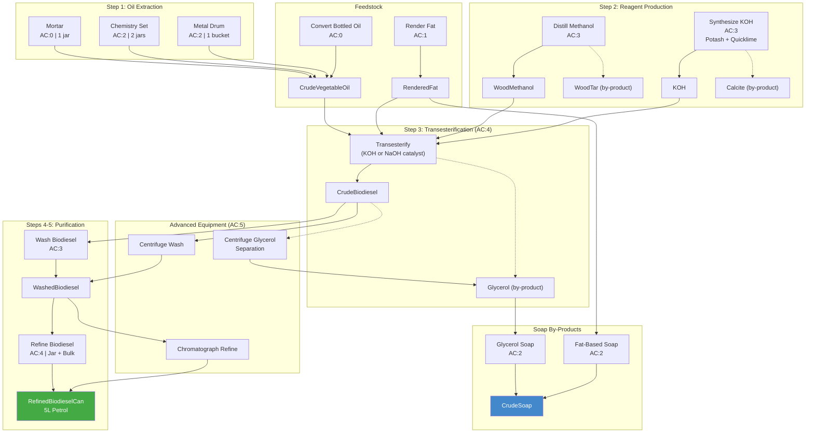
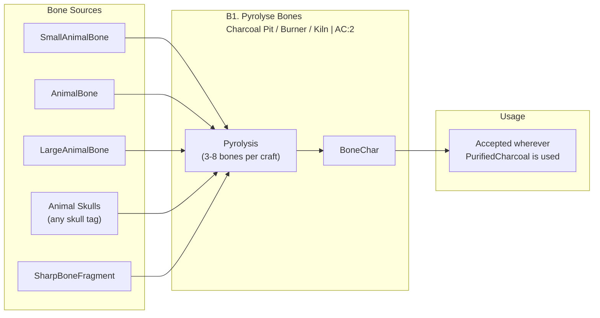

# Recipe Pathways

Complete crafting chains from raw materials to final products. PCP adds 150 recipes across 7 pathways.

## Overview

All pathways share common raw materials and produce interconnected intermediates. Solid arrows show primary material flow; dashed arrows show by-products or alternatives.

```mermaid
graph TB
    subgraph INPUTS["Raw Inputs"]
        CHARCOAL["Charcoal<br/>(foraged or crafted)"]
        CROPS["Crops: Soybeans, Sunflower,<br/>Corn, Flax, Hemp, Peanuts"]
        FATS["Lard / Butter / Margarine"]
        OILS["OilVegetable / OilOlive"]
        BONES["Animal Bones / Skulls"]
        COMPOST["CompostBag / Animal Dung"]
        BATTERY["Car Battery"]
        FERT["Fertilizer"]
        QLIME["Quicklime"]
    end

    subgraph BP["Blackpowder Pathway (Steps 1-7)"]
        CRUSH["CrushedCharcoal"]
        PURIFY["PurifiedCharcoal"]
        POTASH["Potash"]
        KNO3["KNO3 Powder"]
        SULPHUR["SulphurPowder"]
        GUNPOWDER["GunPowder"]
    end

    subgraph BD["Biodiesel Pathway (Steps 1-5)"]
        CRUDE_OIL["CrudeVegetableOil"]
        RENDERED["RenderedFat"]
        METHANOL["WoodMethanol"]
        KOH["KOH"]
        CRUDE_BD["CrudeBiodiesel"]
        WASHED_BD["WashedBiodiesel"]
        REFINED_BD["RefinedBiodieselCan<br/>(5L Petrol)"]
    end

    subgraph BY["By-Products"]
        WOODTAR["WoodTar"]
        CALCITE["Calcite"]
        GLYCEROL["Glycerol"]
        SOAP["CrudeSoap"]
    end

    subgraph BC["Bone Char"]
        BONECHAR["BoneChar"]
    end

    subgraph UTIL["Utility"]
        DCOMPOST["DilutedCompost"]
        H2SO4["SulphuricAcid"]
        LEAD["LeadScrap"]
        PLASTIC["PlasticScrap"]
        ACIDWASH["AcidWashedElectronics"]
    end

    subgraph RC["Recycling Pathway (R1-R8)"]
        WOODGLUE["WoodGlue (R1)"]
        QLIME_OUT["Quicklime (R2)"]
        FERT_OUT["Fertilizer (R3)"]
        SOAP2["Soap (R4)"]
        BANDAGE["Sterilized Bandages (R5)"]
        TACKLE["FishingTackle (R6)"]
        GLUE["Glue (R7)"]
        TRANSISTOR["Transistor + Amplifier (R8)"]
    end

    %% Blackpowder chain
    CHARCOAL --> CRUSH
    CRUSH --> PURIFY
    PURIFY -.-> POTASH
    COMPOST --> DCOMPOST
    DCOMPOST --> KNO3
    FERT --> KNO3
    PURIFY --> KNO3
    BATTERY --> H2SO4
    H2SO4 --> SULPHUR
    PURIFY --> SULPHUR
    KNO3 --> GUNPOWDER
    SULPHUR --> GUNPOWDER
    PURIFY --> GUNPOWDER

    %% Biodiesel chain
    CROPS --> CRUDE_OIL
    OILS --> CRUDE_OIL
    FATS --> RENDERED
    CHARCOAL --> METHANOL
    POTASH --> KOH
    QLIME --> KOH
    CRUDE_OIL --> CRUDE_BD
    RENDERED --> CRUDE_BD
    METHANOL --> CRUDE_BD
    KOH --> CRUDE_BD
    CRUDE_BD --> WASHED_BD
    WASHED_BD --> REFINED_BD

    %% By-products
    METHANOL -.-> WOODTAR
    KOH -.-> CALCITE
    CRUDE_BD -.-> GLYCEROL
    GLYCEROL --> SOAP
    RENDERED --> SOAP

    %% Bone Char alternative
    BONES --> BONECHAR
    BONECHAR -.->|"alt for PurifiedCharcoal"| PURIFY

    %% Utility
    BATTERY --> LEAD

    %% Recycling chain
    WOODTAR --> WOODGLUE
    CALCITE --> QLIME_OUT
    CALCITE --> FERT_OUT
    SOAP --> SOAP2
    SOAP --> BANDAGE
    LEAD --> TACKLE
    PLASTIC --> GLUE
    ACIDWASH --> TRANSISTOR

    style GUNPOWDER fill:#c44,color:#fff
    style REFINED_BD fill:#4a4,color:#fff
    style SOAP fill:#48c,color:#fff
    style BONECHAR fill:#864,color:#fff
    style RC fill:#654,color:#fff
```

---

## Blackpowder Pathway (Detailed)

Seven steps from raw charcoal to gunpowder. Step numbers match in-game recipe display names.

> **Skill tiers**: Steps 1, 3 require no/low skill. Steps 5-7 require Applied Chemistry 3-4. All require the Chemistry Pathways Handbook to learn.

---

## Biodiesel Pathway (Detailed)

Five steps from raw crops to vehicle fuel. Three equipment tiers produce different quantities.

> **6 crop types** each have Mortar, Chemistry Set, and Metal Drum press recipes. **Fat rendering** accepts Lard, Butter, or Margarine. **NaOH** (from zReVaccin) is an alternative catalyst to KOH for transesterification and soap.

---

## Equipment Tier Summary

| Tier | Equipment | Recipe Tag | Container | Capacity | Heat Source |
|------|-----------|-----------|-----------|----------|-------------|
| Mortar | Mortar & Pestle | `AnySurfaceCraft` | Mason Jar | 1.0L | None |
| Chemistry Set | zReVaccin Chemistry Set | `zReVAC2:ChemistrySet` | Mason Jar (x2) | 2.0L | PropaneTank (mode:keep) |
| Metal Drum | Placed Metal Drum Entity | `PCP:MetalDrumStation` | Bucket | 10.0L | Charcoal x3 / Coke x1 / Propane |
| Centrifuge | zReVaccin Centrifuge | `zReVAC2:Centrifuge` | Varies | Varies | None |
| Chromatograph | zReVaccin Chromatograph | `zReVAC2:Chromatograph` | Varies | Varies | None |
| Microscope | zReVaccin Microscope | `zReVAC2:Microscope` | N/A | N/A | None |
| Spectrometer | zReVaccin Spectrometer | `zReVAC2:Spectrometer` | N/A | N/A | None |
| Charcoal Kiln | Charcoal Pit / Burner / Dome Kiln | `WoodCharcoal` | N/A | N/A | Charcoal x3 / Coke x1 / Propane |
| Dome Kiln | Dome Kiln only | `DomeKiln` | N/A | N/A | Charcoal x3 / Coke x1 / Propane |
| Primitive Furnace | Primitive / Smelting / Blast Furnace | `PrimitiveFurnace` | N/A | N/A | Charcoal x3 / Coke x1 / Propane |

> **Container variants**: Many recipes support Mason Jar (1L), Clay Jar (2.5L), and Bucket (10L) alternatives. Container is consumed as input and becomes part of the output.

---

## Bone Char Pathway

Animal bones and skulls are pyrolysed in a charcoal kiln (Charcoal Pit, Charcoal Burner, or Dome Kiln) to produce BoneChar, which substitutes for PurifiedCharcoal in filtration and reagent recipes.

