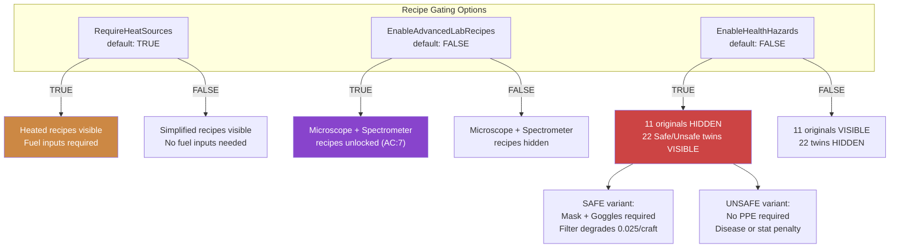
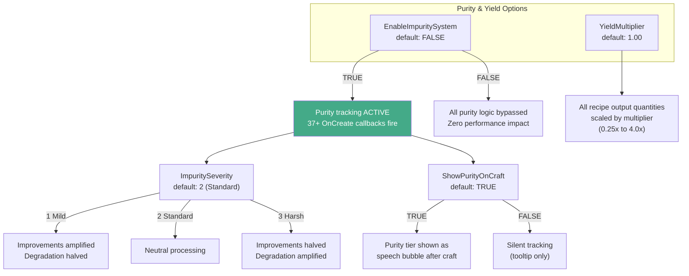

<!--
  ________________________________________________________________________
 / Copyright (c) 2026 Phobos A. D'thorga                                \
 |                                                                        |
 |           /\_/\                                                         |
 |         =/ o o \=    Phobos' PZ Modding                                |
 |          (  V  )     All rights reserved.                              |
 |     /\  / \   / \                                                      |
 |    /  \/   '-'   \   This source code is part of the Phobos            |
 |   /  /  \  ^  /\  \  mod suite for Project Zomboid (Build 42).         |
 |  (__/    \_/ \/  \__)                                                  |
 |     |   | |  | |     Unauthorised copying, modification, or            |
 |     |___|_|  |_|     distribution of this file is prohibited.          |
 |                                                                        |
 \________________________________________________________________________/
-->

# Sandbox Settings Guide

PhobosChemistryPathways provides 13 sandbox options split across two settings pages: gameplay options (recipe gating, purity, yield) and maintenance/reset options. These settings allow server admins and solo players to tune recipe complexity, difficulty, and perform version-upgrade housekeeping.

## Recipe Gating Options

Three boolean options control which recipe variants are visible in the crafting menu:

- **RequireHeatSources** (default: TRUE) -- When enabled, heated recipes require fuel inputs (propane, charcoal, coke). When disabled, simplified no-fuel versions appear instead.
- **EnableAdvancedLabRecipes** (default: FALSE) -- Unlocks microscope and spectrometer recipes requiring Applied Chemistry level 7. Intended for late-game laboratory gameplay.
- **EnableHealthHazards** (default: FALSE) -- Replaces 11 base hazardous recipes with 22 Protected/Unprotected variant pairs. Protected variants require PPE (gas mask + safety goggles) with filter degradation; Unprotected variants risk disease or stat penalties.

## Purity & Yield Options

Four options control the optional purity tracking system and recipe output scaling:

- **EnableImpuritySystem** (default: FALSE) -- Master switch for condition-based purity tracking. When disabled, all purity logic is bypassed with zero performance impact.
- **ImpuritySeverity** (default: 2 / Standard) -- Controls how aggressively purity degrades through recipe chains. Mild (1) amplifies improvements and halves degradation; Standard (2) is neutral; Harsh (3) halves improvements and amplifies degradation.
- **ShowPurityOnCraft** (default: TRUE) -- When enabled, displays the purity tier as a speech bubble after each craft. When disabled, purity is tracked silently and only visible in item tooltips.
- **YieldMultiplier** (default: 1.0) -- Scales all recipe output quantities from 0.25x to 4.0x. Applies to every PCP recipe via PhobosLib's `applyYieldMultiplier`.

## Maintenance / Reset Options

Six options on the dedicated "PCP - Maintenance / Reset" sandbox settings page. The five reset options are one-shot flags: they execute once on game load, then automatically reset to OFF. Reset flags persist across game restarts via world modData to prevent re-execution.

| Option | Default | Description |
|--------|---------|-------------|
| **EnableVesselReplacement** | true | Replaces empty PCP FluidContainers with their vanilla vessel equivalents (mason jar + lid, bottle, bucket, gas can) when the player opens a container. MP-synced. |
| **ResetStripPurity** | false | One-shot: strips all purity modData from PCP items in the player's inventory. |
| **ResetForgetRecipes** | false | One-shot: forgets all learned PCP recipes for the current character. |
| **ResetSkillXP** | false | One-shot: resets Applied Chemistry skill to level 0. |
| **ResetNuclearRemove** | false | One-shot: removes all PCP items from the player's inventory and sub-containers. |
| **ResetNuclearAll** | false | One-shot: executes all four reset operations above in sequence. |
