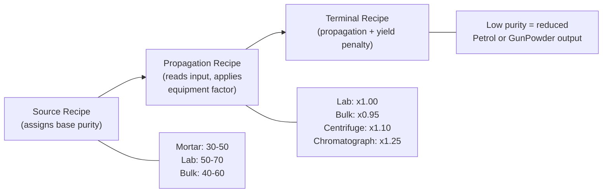

# Sandbox Settings Gating

PCP provides 12 sandbox options that control recipe visibility, system behavior, output scaling, and maintenance. Server admins configure these in the sandbox settings panel under the **PCP_Sandbox** and **PCP_Reset** pages.

> The 7 gameplay options shown below control recipe visibility and behavior. Five additional reset/maintenance options (on a separate sandbox page) are described in the main [README](../../README.md#sandbox-options).

## Settings Overview

```mermaid
graph TB
    subgraph OPTIONS["Sandbox Options"]
        S1["RequireHeatSources<br/>default: TRUE"]
        S2["EnableAdvancedLabRecipes<br/>default: FALSE"]
        S3["EnableHealthHazards<br/>default: FALSE"]
        S4["EnableImpuritySystem<br/>default: FALSE"]
        S5["ImpuritySeverity<br/>default: 2 (Standard)"]
        S6["ShowPurityOnCraft<br/>default: TRUE"]
        S7["YieldMultiplier<br/>default: 1.00"]
    end

    S1 -->|"TRUE"| H_ON["Heated recipes visible<br/>Fuel inputs required"]
    S1 -->|"FALSE"| H_OFF["Simplified recipes visible<br/>No fuel inputs needed"]

    S2 -->|"TRUE"| A_ON["Microscope + Spectrometer<br/>recipes unlocked (AC:7)"]
    S2 -->|"FALSE"| A_OFF["Microscope + Spectrometer<br/>recipes hidden"]

    S3 -->|"TRUE"| Z_ON["11 originals HIDDEN<br/>22 Safe/Unsafe twins VISIBLE"]
    S3 -->|"FALSE"| Z_OFF["11 originals VISIBLE<br/>22 twins HIDDEN"]

    S4 -->|"TRUE"| P_ON["Purity tracking ACTIVE<br/>37+ OnCreate callbacks fire"]
    S4 -->|"FALSE"| P_OFF["All purity logic bypassed<br/>Zero performance impact"]

    P_ON --> S5
    S5 -->|"1 Mild"| SEV1["Improvements amplified<br/>Degradation halved"]
    S5 -->|"2 Standard"| SEV2["Neutral processing"]
    S5 -->|"3 Harsh"| SEV3["Improvements halved<br/>Degradation amplified"]

    P_ON --> S6
    S6 -->|"TRUE"| ANN_ON["Purity tier shown as<br/>speech bubble after craft"]
    S6 -->|"FALSE"| ANN_OFF["Silent tracking<br/>(tooltip only)"]

    S7 --> YIELD["All recipe output quantities<br/>scaled by multiplier<br/>(0.25x to 4.0x)"]

    Z_ON --> SAFE["SAFE variant:<br/>Mask + Goggles required<br/>Filter degrades 0.025/craft"]
    Z_ON --> UNSAFE["UNSAFE variant:<br/>No PPE required<br/>Disease or stat penalty"]

    style H_ON fill:#c84,color:#fff
    style A_ON fill:#84c,color:#fff
    style Z_ON fill:#c44,color:#fff
    style P_ON fill:#4a8,color:#fff
```

---

## RequireHeatSources (Heat Gating)

When **TRUE** (default), recipes that involve heating require fuel inputs:
- **Chemistry Set tier**: PropaneTank consumed via `mode:keep` with `MayDegrade` flag
- **Metal Drum tier**: Charcoal x3, Coke x1, or PropaneTank (mode:destroy + OnCreate partial return)
- **Surface craft tier**: Same fuel options as Metal Drum

When **FALSE**, simplified versions of all heated recipes appear with no fuel inputs. The heated versions are hidden.

> The `UseDelta` on PropaneTank is immutable per recipe. Metal Drum and Surface recipes use `mode:destroy` + an `OnCreate` callback (`pcpReturnPartialPropane`) to consume ~4% fuel per craft, yielding approximately 25 uses per full tank.

---

## EnableHealthHazards (Hazard Gating)

When **TRUE**, 11 dangerous chemistry recipes are replaced by 22 Safe/Unsafe twin variants:

| Original Recipe | Safe Variant | Unsafe Variant |
|----------------|-------------|----------------|
| Distill Methanol | + Gas Mask + Goggles | No mask required |
| Extract Sulphur (x4 variants) | + Gas Mask + Goggles | No mask required |
| Synthesize KOH (x2 variants) | + Gas Mask + Goggles | No mask required |
| Purify Charcoal NaOH (x2 variants) | + Gas Mask + Goggles | No mask required |
| Extract Battery Acid | + Gas Mask + Goggles | No mask required |
| Melt Plastic Scrap (R7) | + Gas Mask + Goggles | No mask required |

**Safe recipes**: Require a gas mask (GasMask, NBCmask, BuildersRespirator, or ImprovisedGasMask) and goggles (SafetyGoggles or SkiGoggles). Filter degrades by 0.025 per craft (~40 crafts to exhaust a standard filter). DustMask is NOT accepted.

**Unsafe recipes**: No PPE required. Risk of EHR disease (if EHR mod active) or vanilla stat penalties (Sickness, Pain, Stress). Protection scales with worn equipment — NBC mask (no filter) reduces effect by 85%, gas mask by 60%.

### Hazard Profiles

| Hazard | Trigger Recipes | EHR Disease | EHR Severe | Vanilla Stress |
|--------|----------------|-------------|------------|----------------|
| `methanol_vapor` | Distill Methanol | corpse_sickness (50%) | pneumonia (5%) | 0.12 |
| `acid_fumes` | Extract Sulphur | corpse_sickness (45%) | pneumonia (10%) | 0.10 |
| `caustic_vapor` | Synthesize KOH, Purify NaOH | corpse_sickness (35%) | none | 0.15 |
| `acid_mist` | Extract Battery Acid | wound_infection (40%) | corpse_sickness (15%) | 0.10 |
| `plastic_fumes` | Melt Plastic (R7) | corpse_sickness (40%) | pneumonia (8%) | 0.12 |

---

## OnTest Function Matrix

Recipe visibility is controlled by `OnTest` functions that check sandbox state. The RequireHeatSources and EnableHealthHazards options create a 2-axis matrix:

| OnTest Function | RequireHeatSources | EnableHealthHazards | Used By |
|---|---|---|---|
| `pcpHeatRequiredCheck` | TRUE | — | Standard heated recipes (non-hazardous) |
| `pcpNoHeatRequiredCheck` | FALSE | — | Simplified recipes (non-hazardous) |
| `pcpHeatAndNoHazardCheck` | TRUE | FALSE | Hazardous originals with heat |
| `pcpNoHeatAndNoHazardCheck` | FALSE | FALSE | Hazardous originals without heat |
| `pcpHeatAndHazardCheck` | TRUE | TRUE | Safe/Unsafe twins with heat |
| `pcpNoHeatAndHazardCheck` | FALSE | TRUE | Safe/Unsafe twins without heat |

Additional standalone checks:
- `pcpHazardEnabledCheck` — TRUE when EnableHealthHazards is ON (gates twin recipes)
- `pcpNoHazardCheck` — TRUE when EnableHealthHazards is OFF (gates original recipes)
- `pcpAdvancedLabCheck` — TRUE when EnableAdvancedLabRecipes is ON (gates Microscope + Spectrometer)

---

## Impurity/Purity System

When **EnableImpuritySystem** is TRUE, every PCP crafting step stamps a purity score (0-100) on its output via `modData["PCP_Purity"]`.

### Purity Tiers

| Tier | Range | Color | Meaning |
|------|-------|-------|---------|
| Lab-Grade | 80-100 | Blue | Exceptional quality |
| Pure | 60-79 | Green | Good quality |
| Standard | 40-59 | Yellow | Average |
| Impure | 20-39 | Orange | Below average |
| Contaminated | 0-19 | Red | Poor quality, yield penalty |

### Severity Scaling (ImpuritySeverity)

| Setting | Equipment Improvement | Equipment Degradation |
|---------|----------------------|----------------------|
| 1 (Mild) | Amplified | Halved |
| 2 (Standard) | Normal | Normal |
| 3 (Harsh) | Halved | Amplified |

---

## YieldMultiplier

Scales all recipe output quantities from 0.25x to 4.0x (default 1.0). Applied via `PhobosLib.applyYieldMultiplier()` in OnCreate callbacks. Affects every recipe that produces countable items.
