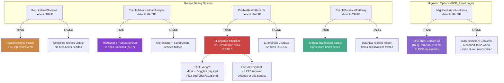
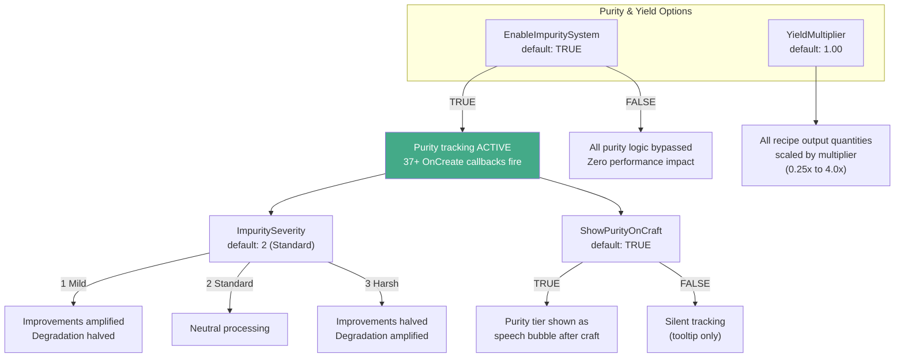

<!--
  ________________________________________________________________________
 / Copyright (c) 2026 Phobos A. D'thorga                                \
 |                                                                        |
 |           /\_/\                                                         |
 |         =/ o o \=    Phobos' PZ Modding                                |
 |          (  V  )     All rights reserved.                              |
 |     /\  / \   / \                                                      |
 |    /  \/   '-'   \   This source code is part of the Phobos            |
 |   /  /  \  ^  /\  \  mod suite for Project Zomboid (Build 42).         |
 |  (__/    \_/ \/  \__)                                                  |
 |     |   | |  | |     Unauthorised copying, modification, or            |
 |     |___|_|  |_|     distribution of this file is prohibited.          |
 |                                                                        |
 \________________________________________________________________________/
-->

# Sandbox Settings Guide

PhobosChemistryPathways provides 19 sandbox options split across four settings pages: gameplay options (recipe gating, purity, yield), concrete mixer options, botanical pathway options, and maintenance/reset options. These settings allow server admins and solo players to tune recipe complexity, difficulty, and perform version-upgrade housekeeping.

## Recipe Gating Options

Four boolean options control which recipe variants are visible in the crafting menu:

- **RequireHeatSources** (default: TRUE) -- When enabled, heated recipes require fuel inputs (propane, charcoal, coke). When disabled, simplified no-fuel versions appear instead.
- **EnableAdvancedLabRecipes** (default: FALSE) -- Unlocks microscope and spectrometer recipes requiring Applied Chemistry level 7. Intended for late-game laboratory gameplay.
- **EnableHealthHazards** (default: FALSE) -- Replaces 11 base hazardous recipes with 22 Protected/Unprotected variant pairs. Protected variants require PPE (gas mask + safety goggles) with filter degradation; Unprotected variants risk disease or stat penalties.
- **EnableBotanicalPathway** (default: TRUE) -- Enables all 30 botanical hemp processing recipes and horticulture items. When disabled, botanical recipes are hidden but already-crafted items remain usable. Requires game restart.

```mermaid
graph TB
    subgraph OPTIONS["Recipe Gating Options"]
        S1["RequireHeatSources<br/>default: TRUE"]
        S2["EnableAdvancedLabRecipes<br/>default: FALSE"]
        S3["EnableHealthHazards<br/>default: FALSE"]
        S4["EnableBotanicalPathway<br/>default: TRUE"]
    end

    S1 -->|"TRUE"| H_ON["Heated recipes visible<br/>Fuel inputs required"]
    S1 -->|"FALSE"| H_OFF["Simplified recipes visible<br/>No fuel inputs needed"]

    S2 -->|"TRUE"| A_ON["Microscope + Spectrometer<br/>recipes unlocked (AC:7)"]
    S2 -->|"FALSE"| A_OFF["Microscope + Spectrometer<br/>recipes hidden"]

    S3 -->|"TRUE"| Z_ON["11 originals HIDDEN<br/>22 Safe/Unsafe twins VISIBLE"]
    S3 -->|"FALSE"| Z_OFF["11 originals VISIBLE<br/>22 twins HIDDEN"]

    S4 -->|"TRUE"| B_ON["30 botanical recipes visible<br/>Horticulture items active"]
    S4 -->|"FALSE"| B_OFF["Botanical recipes hidden<br/>Items still usable if crafted"]

    Z_ON --> SAFE["SAFE variant:<br/>Mask + Goggles required<br/>Filter degrades 0.025/craft"]
    Z_ON --> UNSAFE["UNSAFE variant:<br/>No PPE required<br/>Disease or stat penalty"]

    subgraph MIGRATE["Migration Options (PCP_Reset page)"]
        M1["MigrateHorticultureItems<br/>default: FALSE"]
    end

    M1 -->|"TRUE"| M_ON["One-shot: Convert all<br/>[B42] Horticulture items<br/>to PCP equivalents"]
    M1 -->|"FALSE"| M_AUTO["Auto-detection: Converts<br/>orphaned items when<br/>Horticulture unsubscribed"]

    style H_ON fill:#c84,color:#fff
    style A_ON fill:#84c,color:#fff
    style Z_ON fill:#c44,color:#fff
    style B_ON fill:#4a8,color:#fff
    style M_ON fill:#86c,color:#fff
```

## Purity & Yield Options

Five options control the optional purity tracking system and recipe output scaling:

- **EnableImpuritySystem** (default: TRUE) -- Master switch for condition-based purity tracking. When disabled, all purity logic is bypassed with zero performance impact.
- **ImpuritySeverity** (default: 2 / Standard) -- Controls how aggressively purity degrades through recipe chains. Mild (1) amplifies improvements and halves degradation; Standard (2) is neutral; Harsh (3) halves improvements and amplifies degradation.
- **SkillPurityInfluence** (default: 3 / Standard) -- Controls how much the Applied Chemistry skill affects output purity. None (1): no effect; Low (2): max +2 at level 10; Standard (3): max +5 at level 10; High (4): max +10 at level 10.
- **ShowPurityOnCraft** (default: TRUE) -- When enabled, displays the purity tier as a speech bubble after each craft. When disabled, purity is tracked silently and only visible in item tooltips.
- **YieldMultiplier** (default: 1.0) -- Scales all recipe output quantities from 0.25x to 4.0x. Applies to every PCP recipe via PhobosLib's `applyYieldMultiplier`.

```mermaid
graph TB
    subgraph OPTIONS["Purity & Yield Options"]
        S4["EnableImpuritySystem<br/>default: TRUE"]
        S7["YieldMultiplier<br/>default: 1.00"]
    end

    S4 -->|"TRUE"| P_ON["Purity tracking ACTIVE<br/>37+ OnCreate callbacks fire"]
    S4 -->|"FALSE"| P_OFF["All purity logic bypassed<br/>Zero performance impact"]

    P_ON --> S5["ImpuritySeverity<br/>default: 2 (Standard)"]
    S5 -->|"1 Mild"| SEV1["Improvements amplified<br/>Degradation halved"]
    S5 -->|"2 Standard"| SEV2["Neutral processing"]
    S5 -->|"3 Harsh"| SEV3["Improvements halved<br/>Degradation amplified"]

    P_ON --> S6["ShowPurityOnCraft<br/>default: TRUE"]
    S6 -->|"TRUE"| ANN_ON["Purity tier shown as<br/>speech bubble after craft"]
    S6 -->|"FALSE"| ANN_OFF["Silent tracking<br/>(tooltip only)"]

    S7 --> YIELD["All recipe output quantities<br/>scaled by multiplier<br/>(0.25x to 4.0x)"]

    style P_ON fill:#4a8,color:#fff
```

## Maintenance / Reset Options

Seven options on the dedicated "PCP - Maintenance / Reset" sandbox settings page. The six reset/migration options are one-shot flags: they execute once on game load, then automatically reset to OFF. Reset flags persist across game restarts via world modData to prevent re-execution.

| Option | Default | Description |
|--------|---------|-------------|
| **EnableVesselReplacement** | true | Replaces empty PCP FluidContainers with their vanilla vessel equivalents (mason jar + lid, bottle, bucket, gas can) when the player opens a container. MP-synced. |
| **ResetStripPurity** | false | One-shot: strips all purity modData from PCP items in the player's inventory. |
| **ResetForgetRecipes** | false | One-shot: forgets all learned PCP recipes for the current character. |
| **ResetSkillXP** | false | One-shot: resets Applied Chemistry skill to level 0. |
| **ResetNuclearRemove** | false | One-shot: removes all PCP items from the player's inventory and sub-containers. |
| **ResetNuclearAll** | false | One-shot: executes all four reset operations above in sequence. |
| **MigrateHorticultureItems** | false | One-shot: converts all [B42] Horticulture mod items to PCP equivalents. Preserves fill level, condition, and wet state. Safe to run while Horticulture is still subscribed. Auto-detection also runs as a safety net when Horticulture is unsubscribed and orphaned items are found. |

## Concrete Mixer Options

Three options control the concrete mixer workstation:

- **EnableConcreteMixer** (default: TRUE) -- Master switch for the concrete mixer workstation entity. When disabled, mixer recipes are hidden from the crafting menu.
- **ConcreteMixerYieldBonus** (default: 1.0) -- Output yield multiplier for mixer recipes (0.5x to 3.0x). Stacks with the global YieldMultiplier.
- **MixerFuelDrainRate** (default: 1.0) -- Generator fuel drain rate multiplier during mixer crafting (0.0 to 5.0). Set to 0.0 for free power.
