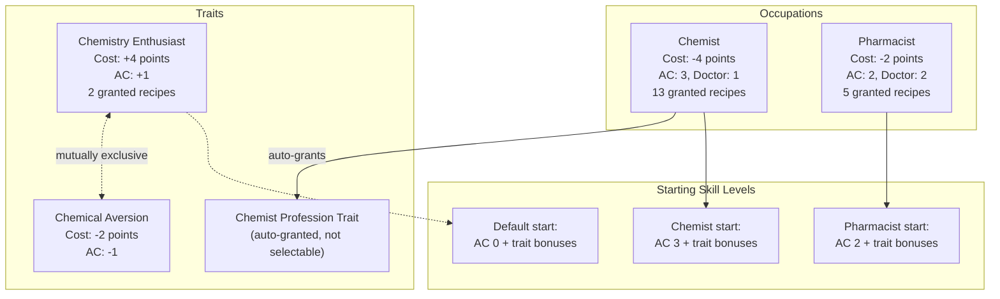
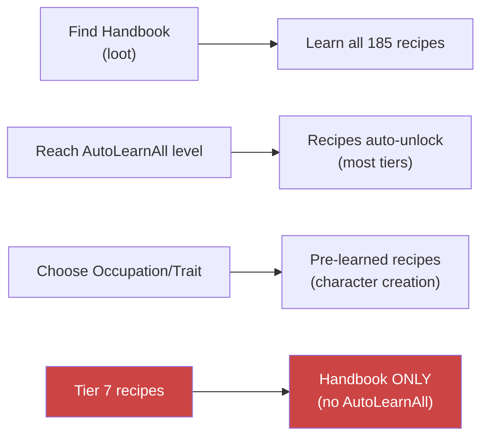

<!--
  ________________________________________________________________________
 / Copyright (c) 2026 Phobos A. D'thorga                                \
 |                                                                        |
 |           /\_/\                                                         |
 |         =/ o o \=    Phobos' PZ Modding                                |
 |          (  V  )     All rights reserved.                              |
 |     /\  / \   / \                                                      |
 |    /  \/   '-'   \   This source code is part of the Phobos            |
 |   /  /  \  ^  /\  \  mod suite for Project Zomboid (Build 42).         |
 |  (__/    \_/ \/  \__)                                                  |
 |     |   | |  | |     Unauthorised copying, modification, or            |
 |     |___|_|  |_|     distribution of this file is prohibited.          |
 |                                                                        |
 \________________________________________________________________________/
-->

# Skill Progression

PhobosChemistryPathways adds a custom `AppliedChemistry` perk under the Crafting parent with a steeper XP curve (75-9000 per level). Two occupations and two traits provide starting skill levels and recipe grants at character creation. Five skill book volumes distributed as loot cover levels 1-10.

## Occupations & Traits

Two occupations (Chemist and Pharmacist) and two mutually exclusive traits (Chemistry Enthusiast and Chemical Aversion) determine starting Applied Chemistry levels and pre-learned recipes.

## Learning Paths

There are three ways to learn PCP recipes: finding and reading the Chemistry Handbook (teaches all 185 recipes), reaching the auto-learn threshold for each recipe tier, or choosing an occupation/trait at character creation for pre-learned recipes. Tier 7 (advanced lab) recipes can only be learned from the handbook.

## Skill Tiers

All 185 recipes are distributed across 7 skill tiers. Higher tiers require more Applied Chemistry XP and gate access to increasingly complex chemistry.

| Tier | AC Level | Unlocks |
|------|----------|---------|
| 0 | 0 | Basic crushing, composting, and simple fat rendering |
| 1 | 1 | Charcoal purification, oil extraction (mortar and pestle), basic soap |
| 2 | 2 | KNO3 synthesis, battery acid extraction, bone char pyrolysis |
| 3 | 3 | Sulphur extraction, methanol distillation, biodiesel transesterification |
| 4 | 4 | Blackpowder mixing, biodiesel washing, recycling recipes |
| 5 | 5 | Refined biodiesel, advanced recycling, agriculture sprays |
| 6 | 6 | Centrifuge and chromatograph recipes, chemical tanning |
| 7 | 7 | Microscope and spectrometer recipes (handbook-only, gated by EnableAdvancedLabRecipes) |
