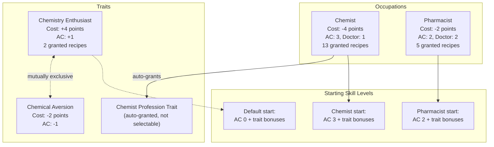

# Applied Chemistry Skill Progression

PCP adds a custom **Applied Chemistry** perk under the Crafting parent. Recipes are gated by 7 skill tiers, with occupations, traits, and skill books providing progression paths.

## Skill Tier System

| Tier | Skill Required | XP Award | AutoLearn At | Representative Recipes | Equipment |
|------|---------------|----------|-------------|----------------------|-----------|
| 0 | None | AC:10 | AC:2 | Crush Charcoal, Mortar Oil Presses, Convert Oil | Mortar |
| 1 | AC:1 | AC:10-15 | AC:3 | Purify Charcoal (Water), Diluted Compost, Render Fat, Wood Glue (R1), Fertilizer (R3) | Chemistry Set |
| 2 | AC:2 | AC:20-25 | AC:4-5 | Purify NaOH, Lab/Bulk Oil Presses, Bone Char, Soap, Battery Acid, Quicklime (R2), Soap (R4) | Chemistry Set / Metal Drum |
| 3 | AC:3 | AC:30-40 | AC:6-7 | Distill Methanol, Synthesize KOH, Extract Sulphur, Wash Biodiesel | Chemistry Set |
| 4 | AC:4 | AC:40-90 | AC:7-8 | Transesterify Oil/Fat, Synthesize KNO3, Mix Blackpowder, Refine Biodiesel | Chemistry Set / Metal Drum |
| 5 | AC:5 | AC:35-50 | AC:8-9 | Centrifuge Wash, Centrifuge Glycerol, Chromatograph Purify | Centrifuge / Chromatograph |
| 7 | AC:7 | AC:80 | **None** | Microscope Analysis, Spectrometer Testing | Microscope / Spectrometer |

> **No Tier 6 exists.** Tier 7 has no AutoLearnAll -- these recipes can ONLY be learned from the handbook. Tier 7 is also gated behind the `EnableAdvancedLabRecipes` sandbox option.

### XP Curve

| Level | 1 | 2 | 3 | 4 | 5 | 6 | 7 | 8 | 9 | 10 |
|-------|---|---|---|---|---|---|---|---|---|---|
| XP Required | 75 | 150 | 300 | 750 | 1,500 | 3,000 | 4,500 | 6,000 | 7,500 | 9,000 |

The curve is steeper than vanilla Crafting perks. With 154 recipes awarding XP, this prevents trivial levelling from grinding a single recipe.

---

## Character Creation

### Occupation Details

**Chemist** (Cost -4):
- Applied Chemistry 3, Doctor 1
- Grants 13 recipes: all mortar oil presses (6), crush charcoal, mix blackpowder, convert vegetable oil, convert olive oil, prepare compost, render fat, purify charcoal (water)
- Can immediately craft Tier 0-3 recipes

**Pharmacist** (Cost -2):
- Applied Chemistry 2, Doctor 2
- Grants 5 recipes: crush charcoal, purify charcoal (water), convert vegetable oil, convert olive oil, prepare compost
- Can immediately craft Tier 0-2 recipes; stronger medical background (Doctor 2)

### Trait Details

| Trait | Cost | Effect | Mutual Exclusion |
|-------|------|--------|-----------------|
| Chemistry Enthusiast | +4 | AC +1, grants Crush Charcoal + Convert Oil | Cannot take Chemical Aversion |
| Chemical Aversion | -2 | AC -1 | Cannot take Chemistry Enthusiast |
| Chemist (profession) | 0 | Auto-granted by Chemist occupation | N/A |

---

## Skill Books

Five volumes of "Applied Chemistry" skill books, green-tinted, distributed in loot. Each volume covers 2 skill levels.

| Volume | Levels Trained | Pages | Loot Locations | Rarity |
|--------|---------------|-------|---------------|--------|
| Vol 1 | 1-2 | 220 | Bookstores, classrooms, medical facilities | Common |
| Vol 2 | 3-4 | 260 | Bookstores, classrooms, medical facilities | Common |
| Vol 3 | 5-6 | 300 | Medical offices | Moderate |
| Vol 4 | 7-8 | 340 | Medical offices | Rare |
| Vol 5 | 9-10 | 380 | Medical storage only | Very Rare |

> Reading a skill book **before** crafting dramatically increases XP gain for the covered levels, following standard PZ skill book mechanics.

---

## Learning Paths

All PCP recipes require `NeedToBeLearn = true`. Recipes can be learned through:

1. **Handbook** (`BkChemistryPathways`): Teaches ALL 154 recipes when read. Found in loot.
2. **AutoLearnAll**: Recipes auto-unlock at the specified Applied Chemistry level (most recipes).
3. **Occupation/Trait grants**: Specific recipes are pre-learned at character creation.
4. **Exception**: Tier 7 recipes (Microscope, Spectrometer) have NO AutoLearnAll and can ONLY be learned from the handbook.

